IPro 497 -- Product Direction Document
======================================

Problem statement
-----------------

IIT does not address the many inconveniences in finding tutors and it discourages their students from seeking help.

- Inconveniences include **commute**, **schedule**, and **compatibility**

Solution
--------

Offer an app that will provide the students the option to access tutors and tutoring **fast.**

Think Tinder for the tutoring experience.

**Success Criteria:**

Newly integrating students are able to easily find tutors that align with their schedule and personality, so students are quicker(more fast) to ask for the help they need.

**Why a tutor?**

New IIT students are unable to access tutoring resources in a manner that best satisfies their schedule and personality needs, causing them to not be able to get help soon enough.

Notes:

- It takes a long time to do homework.
- I don&#39;t have time to study.
- Too many hurdles just to set up a meeting

Why choose a Tutor:

- The pace is slower.
- They pause and ask questions.
- They are **compassionate**.
- What is it about the lecture and textbook that is the problem?
- How do I screen for tutors? You don&#39;t
- Connections to campus, professors, other tutors/struggling students
  - **Community**

Types of tutor (2):

- Immediate help, short term impact on student
- Recurring help, long term impact on student

No_te: Tutors can be all of these things, but they don&#39;t need to be any of these. They simply have to match with the student&#39;s needs/traits. (Lots of parallels with Tinder, dating apps)._

Customer
--------

**Customer Description:**

Struggling students - time conflicts, commuters, unaware of resources, overwhelmed

**Customer Demographic:**

Freshman, sophomore, newly integrating student

### **Customer Persona (need at least 2 personas)**

### Persona Background information:

**Intro:**

There are 4 persona&#39;s for our customer database. There are two students named Ben and Sarah and Tutors&#39; named Mr. Vazquez and Caleb Rimmer. All of these personas are students at IIT.

**Student Persona #1:**

Name: Ben Kenobi

Age: 19 - 24

Status: 2nd year

GPA: 3.34

Degree: Business Student

Minor: Computer Science

Scenario:

Mr. Kenobi is a young college student going for his bachelor&#39;s in Business Administration and came to IIT in Spring 2020. For the past three semesters, Mr. Kenobi has had to navigate school online, which he found to be a blessing as well as a little tedious since he and his family are from Singapore near Stewjohn. He is currently struggling to figure out his finance class since he cannot meet the professor later due to the time difference. Mr. Kenobi desperately wants to do well in his major and dreams of starting his own company one day if he can only pass this class.

Background:

Ben comes from a family that values hard work and so he has always sought out help from others. He has never done online classes before attending IIT, and he wants a way to connect with someone that would help him along. Thankfully, Ben has good time management skills and is always ready to set up a time to hang out with friends. However, being online this past year has really made him wish to have someone to connect with before he comes to the United States this next semester. He has also done extensive investigation into what IIT offers to its online students and has decided to rush a fraternity to make connections at IIT this year.

How did Ben learn about IIT&#39;s Tutoring APP?

Ben made a friend online who is also in the same major as him and asked him if he uses a tool for tutoring since he is a commuter to IIT. Luke told Ben how easy it was to connect with a tutor and how friendly and personal they were. Ben noticed how easy it was to access the app compared to other services he had previously been referred to by his friend Luke. The IIT Tutoring app was the perfect tool to use; he quickly found a tutor that fit his crazy schedule.

Notes:

Background:

- Second year
- Business major/minor: Computer Science
- International student
- Remote student
- Rushed - Phi Kappa Sigma (fall 2021)

Demo/Behavioral Info:

- Wants to improve his performance in school
- Looking for **a tutor to benefit his goals** (quality vs. quantity)
- A **transactional** effort

Pain points:

- Is taking classes online and can&#39;t meet other students from IIT in person yet.
- Dealing with an 8+ time difference, and trying to meet other students, let alone build a meaningful relationship at IIT.
- Seeking someone that has experience in the field and willing to help him.

**Student Persona #2**

Name: Sarah Walker

Age: 19 - 24

Status: 2nd Year

GPA: 3.20

Degree: Business Student

Scenario:

Sarah is a 2nd year business student and she has lived on campus since her freshman year. She is invested in other things and doesn&#39;t have the time to meet with a tutor in the traditional manner. Instead of going to seek a tutor out she spends her time in her room or at the library pouring over her research books and exchanging notes with her fellow classmates.

Background:

Sarah is not from Chicago and spends her free time exploring downtown Chicago with friends outside of school.

How did Sarah learn about IIT&#39;s Tutoring APP?

Sarah learned about the tutoring app in passing from one of her professor&#39;s as they briefly talked about it at the beginning of class. She doesn&#39;t know that much about the service that she would find to be a benefit to her.

Notes:

Background:

- Second year
- Major: Business Not actively participating in Campus Clubs &amp; Activities

Demo/Behavioral Info:

- Looking for help to pass a class (isn&#39;t an overachiever)
- Looking for quick help
- **Transactional** effort

Pain points:

- Scheduling time and location to meet with TAs on campus is too much work
- In person interactions with tutors doesn&#39;t lead to direct Q&amp;A
- Had a bad experience with tutors in the past.

**Tutor Persona #1**

Name: Mr. Vazquez

Age: 19 - 24

Status: 2nd Year

Degree: Computer Science

Scenario:

Mr. Vazquez is a second year Computer Science student at IIT. While Mr. Vazquez still has half of his undergraduate program to complete, he found success in certain classes and he wanted to help his peers in these areas. IIT&#39;s Tutoring App was a great tool he used to quickly and easily identify the students he can help in these classes by filtering the courses and topics that aligned with his skill set (profile customization).

He is especially compassionate about these students&#39; needs because he has gone through his own set of challenging courses. In addition, he has struggled to find sustainable solutions as a commuter student. However, he has found support in the form of organizations and mentorship he believes he can impart on struggling students. Sharing these resources and being empathetic was made easy by the flexibility that the IIT tutoring App provided in its chat and scheduling functions (calendar).

Background:

Mr. Vazquez is a first generation college student. Through trial and error, Vazquez has learned how to be an advocate for himself and find the resources and support that he needs in order to be successful. As a commuter student, he had to put in more effort to find the community he needed. He found it in a student org, SHPE.

How did Vazquez learn about IIT&#39;s Tutoring APP?

Mr. Vazquez learned about IIT&#39;s tutoring app during a class, in which a professor encouraged the class to contact the TA through the tutoring app. Once creating an account, he realized he had visibility to more tutors than the TA, and he could enlist himself as a tutor for the classes he feels comfortable assisting in.

Notes:

Background:

- Second year
- CS major
- First gen
- Commuter
- SHPE

Demo/Behavioral Info:

- Wants to help however they can
- Looking for **long term impact** on student (quality vs. quantity)
- Not **transactional** effort

Pain points:

- Has his own classes to worry about, not enough time
- Hard to meet other students, let alone build a meaningful relationship
- Struggles to share information that could be of help

**Tutor Persona #2**

Name: Caleb Rimmer

Age: 23 - 24

Status: 2nd Year

Scenario:

Mr. Rimmer is a master&#39;s student in Applied Mathematics at IIT. While Mr. Rimmer still has just started his master degree, he has been informed that the best way to improve his resume would be to become a tutor in his field. With his love for mathematics, his professors told him that IIT offered a tutoring program that he could use. The IIT&#39;s Tutoring App was a great tool he used to quickly and easily identify the students he can help in these classes by filtering the courses and topics that aligned with his skill set (profile customization).

He is greatly invested in these students and saw a little of himself in each of them when he was an undergraduate. Since he is working part-time, having something that he could do in his field is a great way to practice and hone his skills for his future career. Sharing these resources and being empathetic was made easy by the IIT tutoring App&#39;s flexibility in its chat and scheduling functions (calendar).

Background:

Mr. Rimmer comes from a family of teachers and has always enjoyed helping his younger siblings. As a person on campus, he enjoys going to 7-eleven and meeting up with his friends and going out and streaming speed run videos in his free time.

How did Ben learn about IIT&#39;s Tutoring APP?

His favorite professor in his department encouraged the master&#39;s degree students to be a part of the IIT Tutors program as a work-study. Mr. Rimmer learned about IIT&#39;s tutoring app by his professor and saw their video ad appearing on IIT&#39;s social media pages. Once Mr. Rimmer created an account, he realized he had visibility to more tutors, and he could enlist himself as a tutor for the classes he feels comfortable assisting in.

Notes:

Background:

- Master Student
- Master&#39;s in Applied Mathematics
- On Campus
- Works part time with the school

Demo/Demographics:

- Quickly provide support to student and immediately move on from their task

- Looking for a short-term impact on student (quality vs. quantity)
- Not transactional effort

Pain Points:

- Is working and managing his classes in his master program.
- Has too much free time and needs an outlet (besides being a streamer).
- Wants to improve his resume for potential companies.

How can we help:

Provide tutors with a chat that allows them to effortlessly upload their solutions to questions asked (no need to meet or go beyond a quick exchange).

Calendar to quickly schedule tutoring sessions/calls to meet students&#39; needs.

## **Other customer(s) or stakeholder(s)**

Teachers, tutors, academic advisors that focus on student&#39;

## **Application type (web app, mobile, website, native client, …)**

Web application

## **Tech stack**

- Node JS
- Express
- React
- MongoDB

### **Client Tech**

Laptop, Smartphone

### **Server Tech**

Node JS

## **Top Application Capabilities (name at least 5)**

Student Profile:
(Answer to **compatibility**)

- Profile customization of sorts (Language, Major, Interest(2 or a few), Classes taken, relationships with professors)
  - Most comfortable topics teaching (strengths tags)
- User profiles

**Customer to Business (C2B)**:

- Chat (IM) (Notifications) (Answer to **commute**)
- General Questions
- Rating system (For instructors) (Positive Reinforcement)
  - Should we take turnaround time into account?

**Scheduling:**

- Pre-meeting information sharing (Picture, attempt, Google meet link?)
- Calendar (Answer to **scheduling**)

**Most important features:**

- Matchmaking (schedule a time to meet with the tutor) - establishing the relationship and figuring out how it is going to work.

Problems:

  - Appointment calendar and test in 2 days, and they are completely booked. What do they do?
  - Allow students to have a chat with IIT students and ask students how we could best offer this program. (This would be for the demo phase)
- User Profile
  - Icon profile.
  - Basic student information
  - Keyword or text about what their strengths are and weaknesses.

### **Your Scenario #1**

Bob is a commuter and has a full day&#39;s worth of classes ahead of him and sometimes he struggles to get to campus on time to attend his 8 am class. He tends to take the Blue and Green line and the car when he is desperate. Today, he is using the train and decides to go on his phone and use his app to pass the time. Being on campus for long periods of time can be a hassle and he tends to meet up with friends while he is waiting since his next class doesn&#39;t start until 3:00pm.

### **Your Scenario #2**

Academically Struggling Students

A new student is struggling with a subject they didn&#39;t really have much experience with from highschool. They do not know where to look for help. The tutor app sends a notification that indicates that if they are struggling, there are open tutor sessions available as soon as the next day. The student logs into the tutor app, schedules with a top recommended tutor who seems like a good match and gets better sleep.

###

### **Your Scenario #3**

A student has just transferred to IIT. At his prior campus, he had a negative experience when seeking for help that discouraged him from leveraging resources moving forward. His tutor was unresponsive and unable to help him understand the work. The tutor app removes any inconvenience that discouraged him before by being able to chat with tutor and professors.

SWOT
----

**Wyzant** 
Different rate paid tutoring service. They have a white board, share files and calendar type system. It can get expensive and for a college student it is not feasible. The demographic of tutors is much older so the information they have is outdated. The general environment is not good, and when you are on the website the. All your lessons are recorded and saved when you use their service.

Strengths: (What does their service offer that is very well done)

They have a white board, video chat, share files and calendar type system. Search engine to find wide range of tutors. All your lessons are recorded and saved when you use their service.

Weaknesses (What are they lacking and what are the drawbacks)

It can get expensive and for a college student it is not feasible. The demographic of tutors is much older so the information they have is outdated. The general environment is not good, and when you are on the website

Operations (what kind of operations do they use)

Threats (to the service we are providing)

**Chegg**

Strengths (What does their service offer that is very well done)

24 hour turnaround time. Tutoring service. Solutions to homework questions. Textbook solutions.

Weaknesses (What are they lacking and what are the drawbacks)

Most people don&#39;t use the tutoring services. Homework solutions don&#39;t provide in-depth service that a tutor could.

Answers aren&#39;t always reliable/helpful

Operations (what kind of operations do they use)

Threats (to the service we are providing)

24 hour turnaround time. Solutions to homework questions. Textbook solutions. (Legacy, they have years of questions from all types of assignments)

**Look further into communication platforms:**

Look at zoom policy and figure out what is the most affordable and has the least amount of barrier.

-Zoom has an interpreter.

Find more companies to do a SWOT Analysis

-Solutions to commonly asked questions. (Chegg)

-What is the value of having readably asked questions and wording.

**MidTerm Presentation:**

**Slides:**

**1)**

**2)**

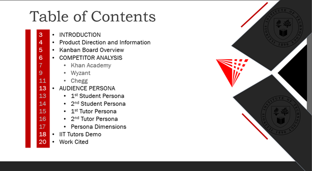

**3)**

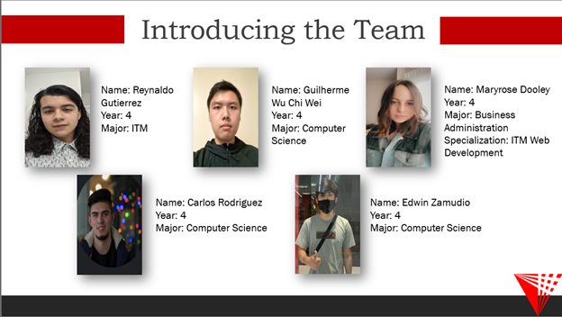

**4)**

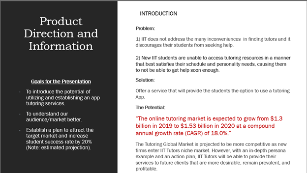

**5)**

**6)**

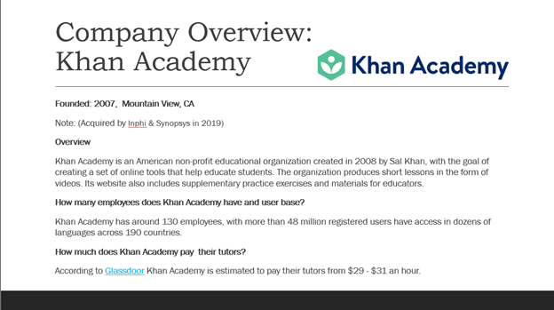

**7)**

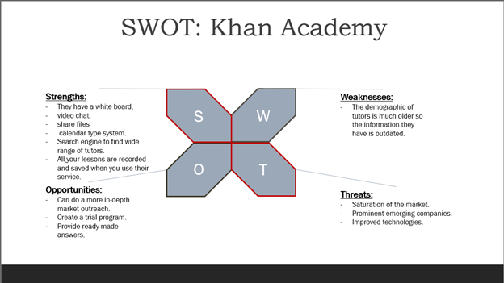

**8)**

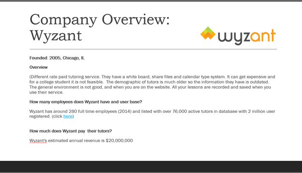

**9)**

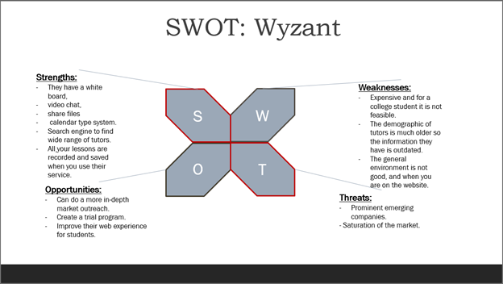

**10)**

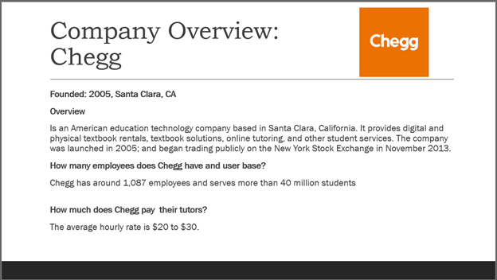

**11)**

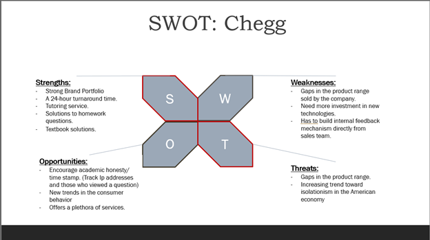

**12)**

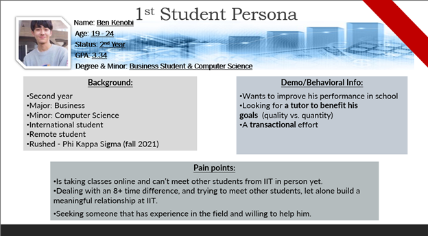

**13)**

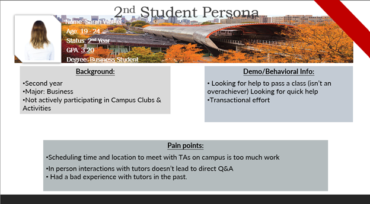

**14)**

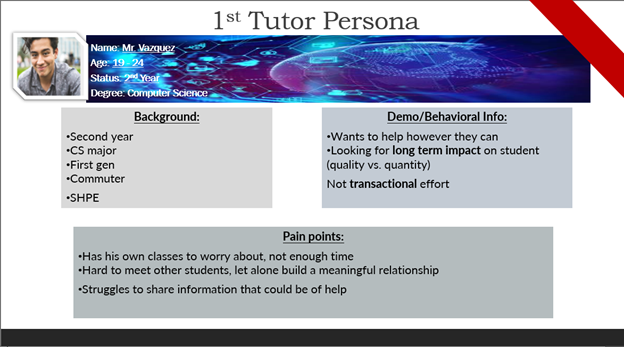

**15)**

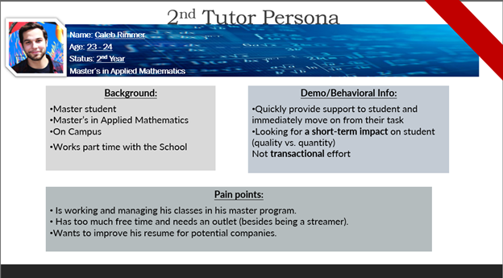

**16)**

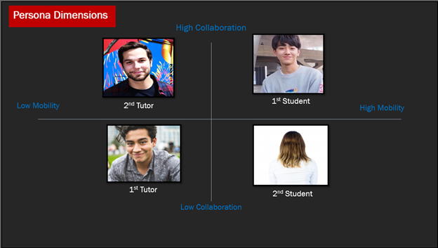

**17)**

**18)**

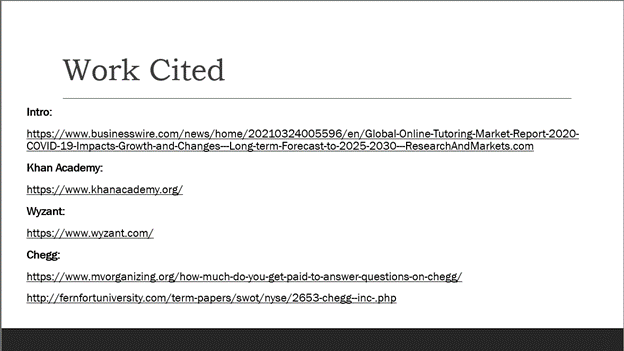

## **Team Members**

| Name | Location | Time zone offset from Chicago (Chicago is 0 offset) |
| --- | --- | --- |
| Reynaldo Gutierrez | Chicago, Illinois | 0 |
| Edwin Zamudio | Chicago, Illinois | 0 |
| Guilherme Wu Chi Wei | Chicago, Illinois | 0 |
| Carlos Rodriguez | Chicago, Illinois | 0 |
| Maryrose Dooley | Park Ridge, Illinois | 0 |

##

## **Team Working Agreement**

A card should be able to be done in a week.

Otherwise, it should be broken down.

1 person per card.

Clean code with Code Review.

- Try to submit PR requests, don&#39;t push to main branch

If you create a card, you should also create/start the description

If you are assigned to a card, create tasks.

Development, Design, Deliverable

Carlos - Design, Deliverable (Minimal dev)

Edwin - All of the Above, Preference for Development

Maryrose - Preference for Design, Adobe applications, Deliverable, (Min. Development for backlog).

Guilherme - preference for development, create card/description, design.

Rey- Development, Design, in that order

Answer 3 important questions for stand-up within 5(?) minutes:

- What did you work on
- What will you work on today/this week
- What did you get blocked on/where can we help?

Time for discussion at end

We will use Github and keep items updated as progress is made:

[https://gitub.com/IPRO-Digital-Development](https://github.com/IPRO-Digital-Development)

[https://github.com/IPRO-Digital-Development/tutor-app](https://github.com/IPRO-Digital-Development/tutor-app) - Github Repo

[https://github.com/orgs/IPRO-Digital-Development/projects/1](https://github.com/orgs/IPRO-Digital-Development/projects/1) - Kanban Board

If we need to meet outside of class we have found a mutually agreeable time at:

Wednesday 5-6 PM

If we need to meet outside of class we will use the following tool/tech for meetings:

[https://discord.gg/crYKxTqr](https://discord.gg/crYKxTqr)

[https://www.when2meet.com/?12788015-fUpcu](https://www.when2meet.com/?12788015-fUpcu)

When we are not meeting together, we will user the following tool/tech for communications:

- Discord
- Email
